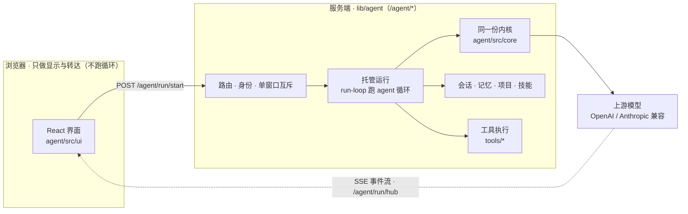

<div align="center">

# 智能体 Agent

**一个能读写文件、执行命令、记住项目的智能体客户端，和一个让它关掉浏览器也能跑完的服务端。**

零框架内核 · React 界面 · 标准 OpenAI / Anthropic 协议 · 服务端托管运行 · **下载即可运行**

**提示词全部可见可改 · 没有 MCP · 纯 CLI 执行 · SKILL.md 技能模式** —— 详见 [为什么是它](#为什么是它和其它-agent-有什么不一样)


</div>

---

> **下载即可运行**：`git clone` 之后 `node standalone.js`，打开终端里打印的地址就能用
> （界面产物已随仓库提供，服务端零 npm 依赖、不用 `npm install`）。见 [快速开始](#快速开始)。

## 这是什么

从自用的文档站里抽出来的智能体子项目：浏览器里一个完整的对话界面，服务端一套
`/agent/*` 能力。模型走**标准 OpenAI / Anthropic 协议**（自建网关、官方 API、中转站都能接），
密钥只存在服务端，不下发前端。

- **设计取舍**：提示词全部可见可改（发给模型的每一句都在一张表里）、没有 MCP（工具内置、无中转进程）、
  纯 CLI 执行（真 shell 进程 + 本机 CLI 工具）、SKILL.md 技能模式（技能是数据，按需加载）——见下一节。
- **循环只在服务端跑**：一轮对话由服务端执行（托管运行），浏览器只做显示与转达——
  **关掉标签页、断网、换窗口都不中断**，回来接着看。同一份内核也随仓库分发，服务端装载的
  就是它（见下节架构）。
- **工具与权限**：文件读写、命令执行、联网搜索、记忆、技能、子智能体；访问级别 + 危险命令闸门
  （「总是允许」清单 + 危险命令自保清单）+ 可访问目录白名单。
- **记忆三层**：全局记忆 / 项目记忆（服务端 Markdown 文件夹）/ 会话记忆，另有自动压缩与用量统计。
- **技能**：吃主流 `SKILL.md` 结构，可预览（dryRun）后再安装，可按需加载不占上下文。
- **工程态度**：内核零框架、可在 Node 下直接单测；状态容器快照语义；217 个用例 + lint / 重复代码 / 模块环三道静态检查，全部离线可跑。
- **两种宿主**：可以挂进自带文档站的宿主（`server.js`，仓库里留档），也可以**单独跑**——
  仓库自带 `standalone.js` 这一份最小宿主（静态服务 + 登录 + `/agent/*`），clone 下来就能起来。

## 为什么是它：和其它 Agent 有什么不一样

主流 Agent 客户端（Claude Code、Cursor、Cline、各类 MCP 客户端）把能力放在黑盒或扩展包里：
提示词写死在代码里看不到，工具靠 MCP 服务器外挂，扩展得打包安装。这个项目的取舍正相反，
下面四条都能在界面上当场验证。

### 一、提示词全部可见、可改

凡是发给模型的文本都在一张**提示词登记表**里（源码 `agent/src/core/prompts.js`；界面 **设置 → 提示词**）：
主系统提示词、Agent 行为准则、每个工具的使用说明与 schema 描述、记忆与技能的注入文本、
上下文压缩指令、循环里注入的短句、输入框 `/` 触发的提示词模板——**逐条列出、逐条可改**，
改坏了「恢复默认」一键回退。

关键在「同源」：**模型的工具定义直接从这张表取值**（`agent-defs.js` 里 schema 的 description
与参数说明就是登记表的条目）。界面上改一句描述，下一轮发给模型的就是改过的那句，不是两处各写一份。
开关也在同一处——比如关掉内置的「联网搜索」技能，`web_search` 工具**直接不注册**：
模型不知道有联网这回事，而不是"给了工具再祈祷它别用"。

### 二、没有 MCP

不写 `.mcp.json`、不起 MCP server、没有 JSON-RPC 中转层。文件、命令、联网搜索、记忆、技能、
子智能体都是内核直连的**内置工具**，schema 与说明就是上面那张可编辑的表。少一个进程、
少一层协议，权限判定还能看见真实的 ACL（文件工具以绑定系统账号的身份判定读写）。

> 早期版本用 MCP 文件系统服务器做过落盘；2026-09 起被内置文件工具 + 记忆 + 技能取代——
> 记忆与技能成为一等公民之后，MCP 能提供的东西就没有一样是非它不可的了。

### 三、纯 CLI

- **执行就是真命令行**：`run_command` 起的是真的 shell 进程，以你在**设置 → 本机账号**里绑定的
  系统账号身份运行（同用户 `/bin/sh -c`，不同用户走 `su`，密码只走 stdin 管道）——
  它能做什么完全由操作系统的权限决定，与你在终端里用那个账号敲一致。
- **联网搜索**走本机 **AnySearch CLI**：默认匿名调用，零密钥开箱可用（要提额度再配 `ANYSEARCH_API_KEY`）。
- **技能与记忆**是磁盘上的 Markdown / JSON（技能表 `prompts.json`、项目记忆是 `.md` 文件夹），
  任何编辑器都能直接读改。
- **跑起来与发布都是一条命令**：`node standalone.js`（服务端零 npm 依赖、不用 `npm install`）／
  `./tools/sync.sh`（站点代码 → 仓库 → 推送）。

### 四、技能模式（SKILL.md）

技能吃主流 `SKILL.md` 结构（frontmatter + Markdown 正文），并且**是数据不是插件**：

- **渐进披露**：每轮只把技能的名称与用途注入系统提示，正文等模型真要动手时用 `use_skill` 加载——
  技能写多长都不占上下文，这也是能把长流程写进技能的原因。
- **可写、可改、可导入**：模型自己能 `skill_write` 新建/改写、`skill_delete` 删除；
  `skill_import` 从 `~/.agents/skills`、`~/.zcode/skills`、`~/.claude/skills` 这类目录装现成的技能，
  怕装错可以先 `dryRun` 预览；人也可以在 设置 → 提示词 → ② 技能 里编辑同一份数据。
- **改技能不用重启、不用重新构建**——它是运行时的数据，不是编译进去的代码。

## 架构



**一轮对话只有一种跑法：托管运行。** 循环跑在服务端——`lib/agent/run-loop.js` 装载的正是
`agent/src/core/` 这份内核（`core/agent.js` 的循环、工具分发、协议适配、组装；经 `run-core.js`
把 HTTP 换成进程内直调、最后一跳换成本机直连上游），所以**同一份内核只有一份实现**，
浏览器里不再跑它。界面订阅 `GET /agent/run/hub` 的一条 SSE 看本账号全部运行，
关掉标签页、断网、换窗口都不中断。

浏览器侧仍会直接发起的上游请求只剩两类**单次调用**（都经 `/agent/upstream/*` 代转、密钥仍在
服务端注入）：设置里的「拉取模型清单」，以及手动压缩（把较早对话压成摘要的那一次）。
模块清单与调用流程见 [`agent/ARCHITECTURE.md`](agent/ARCHITECTURE.md)。

| 层 | 位置 | 说明 |
| --- | --- | --- |
| 内核 | `agent/src/core/` | 循环 / 工具分发 / 协议适配 / 上下文压缩 / 记忆 / 策略。不认识 React，依赖全部注入；**由服务端装载运行**（浏览器侧只用它做注入预览、手动压缩与状态） |
| 界面 | `agent/src/ui/` | React 19 + Tailwind v4 + shadcn 风格组件；快照式状态订阅 |
| 服务端 | `lib/agent/` | `/agent/*`：探针 · 存储 · 上游代转 · 托管运行 · 工具 · 技能 · 项目 · 归档 · 搜索 |

## 目录结构

```
standalone.js         ★ 独立运行入口：不需要宿主站点，node standalone.js 直接起服务
agent/               界面构建工程（改这个子项目的唯一入口）
  src/core/            零框架内核（可在 Node 下单测）
  src/ui/              React 界面：state / features / components
  test/                node --test 用例（当前 217 个）
  build.mjs            esbuild + Tailwind CLI 构建脚本
  README.md            工程说明 + 开发约定（改代码前先读）
  ARCHITECTURE.md      模块清单 · 调用流程 · 必须守住的不变量
lib/agent/           服务端（/agent/* 的实现）
public/llm-chat/     页面壳 index.html + 构建产物 vendor/（★ vendor 入库，见下）
server.js            宿主站点入口（留档）：/agent/* 怎么挂上来的
lib/*.js             宿主依赖留档（standalone.js 也直接用它们，见 HOST-DEPS.md）
tools/users.js       ★ 账号管理（独立运行用）：list / add / passwd
tools/sync.sh        站点 → 仓库：同步 + 提交 + 推送（提交前跑依赖闭包检查）
tools/restore.sh     仓库 → 站点：回滚（自动备份 + 重建 + 提示重启）
tools/deps-check.mjs 入口依赖闭包检查：仓库里缺文件就拦住发布（2026-10-03 事故的守卫）
tools/paths.conf     上面几个脚本共用的路径清单
```

> `public/llm-chat/vendor/`（界面构建产物，约 850KB）**随仓库分发**：没有它，下载者必须先
> `npm install && npm run build` 才能看到界面。它由 `agent/src` 构建得出，`tools/sync.sh`
> 会随站点一起刷新；只想改后端 / 跑服务端的人可以完全不碰 `agent/`。

## 快速开始

要求：**Node ≥ 20**（界面产物已随仓库提供，不用 `npm install`）。

### 一、直接跑起来（推荐先走这条）

```bash
git clone https://github.com/youlikeorange/wenming-agent.git
cd wenming-agent
node standalone.js
```

终端会打印地址与**首次自动创建的管理员密码**（只显示这一次）：

```
  界面      http://127.0.0.1:4174/llm-chat/
  数据      ~/.local/share/wenming-agent
  管理员    admin / xxxxxxxxxxxxx
```

浏览器打开该地址 → 右上角登录（用上面打印的账号）→ **设置 → 模型** 里填一个服务商
（OpenAI / Anthropic 协议都行，密钥只存服务端、不下发浏览器）→ 开始对话。

```bash
node standalone.js --port 8080 --host 0.0.0.0    # 换端口 / 供局域网访问
node standalone.js --state-dir ./data            # 数据放到指定目录
node tools/users.js list                         # 账号管理
node tools/users.js add someone hunter2 --admin  # 建账号（省略密码则随机生成）
node tools/users.js passwd admin                 # 改密码
```

独立运行说明：
- **数据目录**默认 `~/.local/share/wenming-agent`（`STATE_DIR` 可覆盖）。账号、会话、记忆、
  技能、模型密钥全在这里，格式与挂到文档站时完全一致。
- **单用户开箱即用**：首次启动建一个 `admin`；没有注册页，加人用 `tools/users.js`。
- 受 SECURITY 约束的端口默认只监听 `127.0.0.1`；要给别人用请自行加反代 / TLS（`--host 0.0.0.0`
  会把「用绑定账号执行命令」的能力暴露给能访问该端口的人）。
- 文件与命令工具的权限 = **你在「设置 → 本机账号」里绑定的那个系统账号的权限**（绑定用 `su`
  验一次密码，密码不落盘）；不绑定也能用，只是没有文件与命令工具。
- 联网搜索需要一个 AnySearch CLI（`ANYSEARCH_CLI` 指定脚本路径），没装则该工具报错，其余功能不受影响。

### 二、参与开发（构建界面 + 跑测试）

```bash
cd agent
npm install          # 首次
npm run build        # 产出 ../public/llm-chat/vendor/{agent.js,agent.css}
npm test             # node --test：内核 / 协议 / 工具闸门 / 参数 / 状态编排（217 个）
npm run lint         # eslint（显式开 no-undef，warning 有只减不增的预算）
npm run dup          # jscpd：重复代码块（有预算上限）
npm run cycles       # madge：模块环（必须为 0）
npm run check        # 上面几件一起跑
```

> 想把这套挂回自带的文档站（含文档/媒体/剧本编辑器），用仓库根的 `server.js` —— 那需要
> 仓库外的宿主模块（`lib/docs.js`、`lib/media.js`、`lib/api.js` 等），本仓库只有留档。
> 独立运行不需要它们，入口就是 `standalone.js`。

## 部署

### 独立部署（standalone.js）

```bash
# 前台跑
node standalone.js --host 0.0.0.0 --port 4174

# 后台跑（nohup；日志自己收）
nohup node standalone.js --host 0.0.0.0 --port 4174 > agent-standalone.log 2>&1 &
```

### 挂到宿主站点

```bash
# 界面：产物落到站点的 public/llm-chat/vendor/，刷新页面即生效
cd agent && npm run build

# 服务端：lib/agent/* 的改动必须重启站点才生效
cd .. && ./down.sh && ./up.sh
```

> 两种入口共用同一份数据格式，但**别让两个进程同时写同一个 `STATE_DIR`**：串行锁
> （`lib/lock.js`）与单窗口互斥（`lib/agent/presence.js`）都在进程内存里，跨进程互相看不见。

## 版本管理与回滚

这个仓库的存在理由：**改了出问题，一条命令退回去**。

```bash
# 站点代码 → 本仓库（同步 + 提交 + 推送；--check 只看差异）
./tools/sync.sh -m "修复 xxx"
./tools/sync.sh --check

# 留一个可回滚的版本点
git tag -a v2.0.1 -m "稳定版：xxx" && git push origin main --follow-tags

# 回滚：备份现状 → 覆盖 → 重建界面 → 提示重启
./tools/restore.sh --dry-run v2.0.0     # 先看它准备做什么
./tools/restore.sh v2.0.0
```

两个脚本都从 `tools/paths.conf` 读路径清单，站点根目录按 `-s` > `SITE_ROOT` > `tools/site.conf`
（本机配置，不入库）的顺序取。`restore.sh` 的安全设计：覆盖前把站点现状打包到
`../wenming-agent-backups/`、打印「站点与目标版本的差异」防止误回滚、默认不动宿主公共件、
回滚后自动重建界面产物。

## 数据边界：仓库里没有什么

用户数据与模型密钥**不在本仓库任何路径下**——它们由进程运行时写在宿主机的 `STATE_DIR`：

| 部署方式 | `STATE_DIR` 默认值 |
| --- | --- |
| 独立运行（`standalone.js`） | `~/.local/share/wenming-agent` |
| 挂到文档站 | `~/.local/share/wenming-web`（站点与其它子项目共用） |

目录内的结构（权限 0600）：

| 位置 | 内容 |
| --- | --- |
| `permissions.json` | 账号（scrypt 口令散列）与登录会话 |
| `userdata/<账号>/agent.json` | 模型配置（含 API 密钥）/ 参数 / 外观 / 账号绑定 / 可访问目录 |
| `agent/<账号>/sessions.json` | 会话（含会话记忆与压缩摘要） |
| `agent/<账号>/memory.json`、`prompts.json` | 全局记忆、提示词登记表与技能 |
| `agent/<账号>/projects/<id>/`、`archive/`、`downloads/` | 项目元信息与项目记忆 Markdown、归档、待下载 |

同样不入库的还有：`node_modules`、内部审计记录（工程文档里提到的 `AUDIT*.md` 是内部资料，
只留本机）、每台机器自己的 `tools/site.conf`。构建产物 `public/llm-chat/vendor/` 则**入库**
（下载即可运行的前提，见「目录结构」）。

## 宿主依赖

`lib/agent/` 依赖站点公共件：`lib/auth.js`（登录）、`lib/config.js`、`lib/http.js`、`lib/ids.js`
（标识符规则）、`lib/lock.js`、`lib/paths.js`（状态目录与账号名校验）、`lib/security.js`
（路径安全与安全响应头）、`lib/state.js`、`lib/upstream-http.js`、`lib/userdata.js`、
`lib/zip.js`（可执行文件打包），以及 `server.js` 里对 `/agent/*` 的挂载。它们按真实相对路径同步在
仓库里——**`standalone.js` 与仓库里的服务端测试都直接 require 它们**；`restore.sh` 默认**不写回**
站点，因为它们是站点公共件，其他子项目也在用。清单与原因见 [`HOST-DEPS.md`](HOST-DEPS.md)。

## 开发约定

- [`agent/README.md`](agent/README.md)：要记住的约定，每条都对应一次真实故障
  （内核不认识 React、状态快照语义、输入框必须走 IME 组件、适配器第 4 参数是 opts……）。
- [`agent/ARCHITECTURE.md`](agent/ARCHITECTURE.md)：模块清单与调用流程，§8 是回归清单。
- [`CHANGELOG.md`](CHANGELOG.md)：版本要点。

## 说明

- 仓库未附许可证：代码公开可见，但保留所有权利；要复用请先开 issue 聊。
- 版本号与 `agent/package.json` 的 `version` 对齐，tag 打在对应快照的提交上（当前 `v2.1.0`）。
