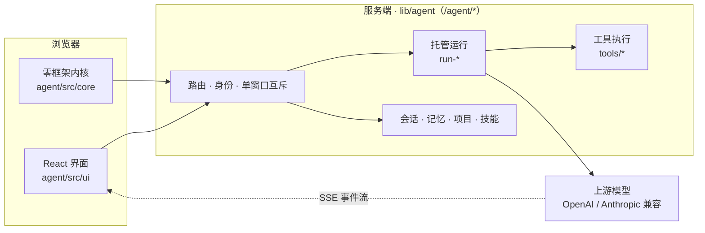

<div align="center">

# 智能体 Agent

**一个能读写文件、执行命令、记住项目的智能体客户端，和一个让它关掉浏览器也能跑完的服务端。**

零框架内核 · React 界面 · 标准 OpenAI / Anthropic 协议 · 服务端托管运行


</div>

---

## 这是什么

从自用的文档站里抽出来的智能体子项目：浏览器里一个完整的对话界面，服务端一套
`/agent/*` 能力。模型走**标准 OpenAI / Anthropic 协议**（自建网关、官方 API、中转站都能接），
密钥只存在服务端，不下发前端。

- **双层运行**：可以在浏览器里跑本地循环，也可以交给服务端跑——**托管运行时关掉标签页、断网、换窗口都不中断**，回来接着看。
- **工具与权限**：文件读写、命令执行、联网搜索；访问级别 + 危险命令闸门（「总是允许」清单）+ 可访问目录白名单。
- **记忆三层**：全局记忆 / 项目记忆（服务端 Markdown 文件夹）/ 会话记忆，另有自动压缩与用量统计。
- **技能**：吃主流 `SKILL.md` 结构，可预览（dryRun）后再安装。
- **工程态度**：内核零框架、可在 Node 下直接单测；状态容器快照语义；170 个用例 + lint / 重复代码 / 模块环三道静态检查，全部离线可跑。

## 架构



一轮对话的两种跑法：**本地循环**（`core/agent.js` 在浏览器里跑，请求经 `/agent/upstream/*` 代转）
与**托管运行**（`POST /agent/run/start` 起在服务端，界面订阅 SSE）。两者共用同一份内核代码。
模块清单与调用流程见 [`agent/ARCHITECTURE.md`](agent/ARCHITECTURE.md)。

| 层 | 位置 | 说明 |
| --- | --- | --- |
| 内核 | `agent/src/core/` | 循环 / 工具分发 / 协议适配 / 上下文压缩 / 记忆 / 策略。不认识 React，依赖全部注入 |
| 界面 | `agent/src/ui/` | React 19 + Tailwind v4 + shadcn 风格组件；快照式状态订阅 |
| 服务端 | `lib/agent/` | `/agent/*`：探针 · 存储 · 上游代转 · 托管运行 · 工具 · 技能 · 项目 · 归档 · 搜索 |

## 目录结构

```
agent/               界面构建工程（改这个子项目的唯一入口）
  src/core/            零框架内核（可在 Node 下单测）
  src/ui/              React 界面：state / features / components
  test/                node --test 用例（当前 170 个）
  build.mjs            esbuild + Tailwind CLI 构建脚本
  README.md            工程说明 + 开发约定（改代码前先读）
  ARCHITECTURE.md      模块清单 · 调用流程 · 必须守住的不变量
lib/agent/           服务端（/agent/* 的实现）
public/llm-chat/     页面壳 index.html + 构建产物目录（vendor/ 不入库）
server.js            宿主入口（留档）：/agent/* 怎么挂上来的
lib/*.js             宿主依赖留档（见 HOST-DEPS.md）
tools/sync.sh        站点 → 仓库：同步 + 提交 + 推送
tools/restore.sh     仓库 → 站点：回滚（自动备份 + 重建 + 重启提示）
tools/paths.conf     上面两个脚本共用的路径清单
```

## 快速开始

要求 Node ≥ 20 与 npm。

```bash
cd agent
npm install          # 首次
npm run build        # 产出 ../public/llm-chat/vendor/{agent.js,agent.css}
npm test             # node --test：内核 / 协议 / 工具闸门 / 参数 / 状态编排
npm run lint         # eslint（显式开 no-undef）
npm run dup          # jscpd：重复代码块（有预算上限）
npm run cycles       # madge：模块环（必须为 0）
npm run check        # 上面几件一起跑
```

> 想直接跑起整个应用，还需要宿主站点（进程入口 `server.js`、文档站账号登录、按账号的
> `STATE_DIR` 存储）。本仓库是子项目的**源码快照 + 回滚工具**，不含宿主站点本身。

## 部署

```bash
# 界面：产物落到站点的 public/llm-chat/vendor/，刷新页面即生效
cd agent && npm run build

# 服务端：lib/agent/* 的改动必须重启站点才生效
cd .. && ./down.sh && ./up.sh
```

## 版本管理与回滚

这个仓库的存在理由：**改了出问题，一条命令退回去**。

```bash
# 站点代码 → 本仓库（同步 + 提交 + 推送；--check 只看差异）
./tools/sync.sh -m "修复 xxx"
./tools/sync.sh --check

# 留一个可回滚的版本点
git tag -a v2.0.1 -m "稳定版：xxx" && git push origin main --follow-tags

# 回滚：备份现状 → 覆盖 → 重建界面 → 提示重启
./tools/restore.sh --dry-run v2.0.0     # 先看它准备做什么
./tools/restore.sh v2.0.0
```

两个脚本都从 `tools/paths.conf` 读路径清单，站点根目录按 `-s` > `SITE_ROOT` > `tools/site.conf`
（本机配置，不入库）的顺序取。`restore.sh` 的安全设计：覆盖前把站点现状打包到
`../wenming-agent-backups/`、打印「站点与目标版本的差异」防止误回滚、默认不动宿主公共件、
回滚后自动重建界面产物。

## 数据边界：仓库里没有什么

用户数据与模型密钥**不在本仓库任何路径下**——它们由站点运行时写在宿主机的 `STATE_DIR`
（默认 `~/.local/share/wenming-web`，权限 0600）：

| 位置 | 内容 |
| --- | --- |
| `userdata/<账号>/agent.json` | 模型配置（含 API 密钥）/ 参数 / 外观 / 账号绑定 / 可访问目录 |
| `agent/<账号>/sessions.json` | 会话（含会话记忆与压缩摘要） |
| `agent/<账号>/memory.json`、`prompts.json` | 全局记忆、提示词登记表与技能 |
| `agent/<账号>/projects/<id>/`、`archive/` | 项目元信息与项目记忆 Markdown、归档 |

同样不入库的还有：`node_modules`、构建产物 `public/llm-chat/vendor/`、内部审计记录
（工程文档里提到的 `AUDIT*.md` 是内部资料，只留本机）、每台机器自己的 `tools/site.conf`。

## 宿主依赖

`lib/agent/` 依赖宿主站点公共件：`lib/auth.js`、`lib/config.js`、`lib/http.js`、`lib/lock.js`、
`lib/state.js`、`lib/upstream-http.js`、`lib/userdata.js`，以及 `server.js` 里对 `/agent/*` 的挂载。
它们按真实相对路径同步在仓库里（这样仓库里的服务端测试能直接跑，也留下「当时线上是什么样」的记录），
但 `restore.sh` 默认**不写回**——它们是站点公共件，其他子项目也在用。清单与原因见
[`HOST-DEPS.md`](HOST-DEPS.md)。

## 开发约定

- [`agent/README.md`](agent/README.md)：要记住的约定，每条都对应一次真实故障
  （内核不认识 React、状态快照语义、输入框必须走 IME 组件、适配器第 4 参数是 opts……）。
- [`agent/ARCHITECTURE.md`](agent/ARCHITECTURE.md)：模块清单与调用流程，§8 是回归清单。
- [`CHANGELOG.md`](CHANGELOG.md)：版本要点。

## 说明

- 仓库未附许可证：代码公开可见，但保留所有权利；要复用请先开 issue 聊。
- 版本号与 `agent/package.json` 的 `version` 对齐，tag 打在对应快照的提交上（当前 `v2.0.0`）。
